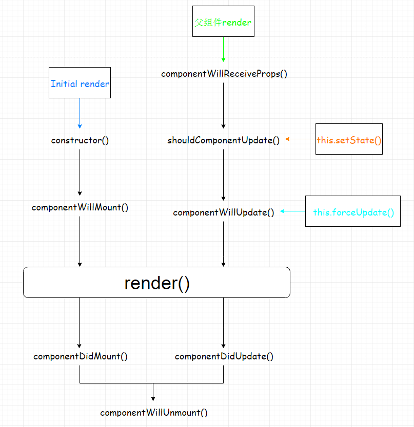
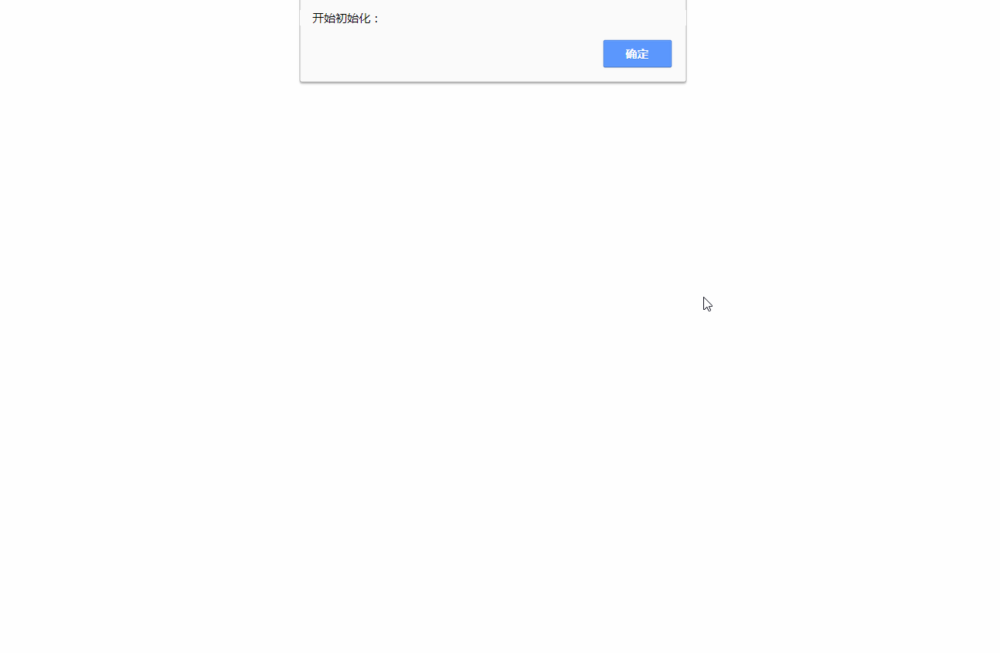

### React-component-cycle
### 用代码方式在浏览器中体验一遍React的组件周期过程

- Mounting(挂载阶段)
	- getDefaultProps
	- getInitialState
	- componentWillMount
    - render
	- componentDidMount
- Updating(运行阶段)
	- componentWillReceiveProps
	- shouldComponentUpdate
	- componentWillUpdate
	- render
	- componentDidUpdate
- Unmounting(卸载阶段)
	- componentWillUnmount

图解: 

以下内容大部分总结于：https://github.com/superman66/Front-End-Blog/issues/2

### componentWillMount
componentWillMount()是在render()方法之前被调用。在该方法中进行同步 setState 不会导致重绘。
componentWillMount()是唯一一个在服务器端渲染调用的生命周期钩子。

是否可以使用setState(): 可以

### componentDidMount()
componentDidMount() 在组件挂载之后立即执行。适用于：
- 需要初始化 DOM 节点的操作
- AJAX 请求；
在该钩子函数里面，可以使用 setState()，但是会触发重新渲染（re-render）

是否可以使用setState(): 可以

### componentWillReceiveProps(nextProps)
该钩子函数将会在已挂载组件（mounted component）接收到新的 props 之前调用。适用于：
- 更新 state的值（比如重置）
- 比较 this.props 和 nextProps
需要注意的是，即使 Props 没有发生变化，React 也有可能会调用该钩子函数。所以如果你想要真正处理 Props 的变化，要记得比较当前 props 和 nextProps
出现这种情况的场景：当父组件导致了该组件的 re-render 时，就会出现上述的情况。

是否可以使用setState(): 可以

### shouldComponentUpdate(nextProps, nextState)
当组件接收到新的 Props 或者 state 时，要进行 rendering 之前会调用 shouldComponentUpdate()。该钩子函数用于告诉 React 组件是否需要重新渲染。
shouldComponentUpdate()默认返回 true。
shouldComponentUpdate()在两种情况下不会被调用：
- 初始化渲染
- 使用了 forceUpdate() 情况下
当 shouldComponentUpdate() 返回 false 的时候，此时 state 发生改变，并不阻止子组件进行重新渲染。但是当前的组件 componentWillUpdate()、 render() 和 componentDidUpdate() 将不再执行。

### componentWillUpdate()
state or props 更新后re-render之前调用。
不能在这里调用 setState，如果需要设置 state，应该在 componentWillReceiveProps() 中调用 setState()

是否可以使用setState(): 不可以

### componentDidUpdate()
在组件更新之后马上调用。在该钩子函数内，你可以：
- 操作 DOM
- 发起网络请求

是否可以使用setState(): 可以

### componentWillUnmount()
在组件卸载和销毁前调用。在该钩子函数内可以做一些清除工作，比如：
- 取消定时器
- 取消网络请求
- 解绑 DOM 事件

是否可以使用setState(): 不可以

### Question
#### React生命周期ComponentWillMount可否使用ajax,为什么？
答：如果要强行使用Ajax的话是可以的，但不推荐。
原因：
- 可能DOM还未准备好接收数据导致错误
- 这样不利于同构（SSR与前端公用一套代码），因为后端无法使用传统Ajax。最好将Ajax写在ComponentDidMount，因为服务端不会执行这一步，有利于同构。当然，强行使用fetch也是可行的。
